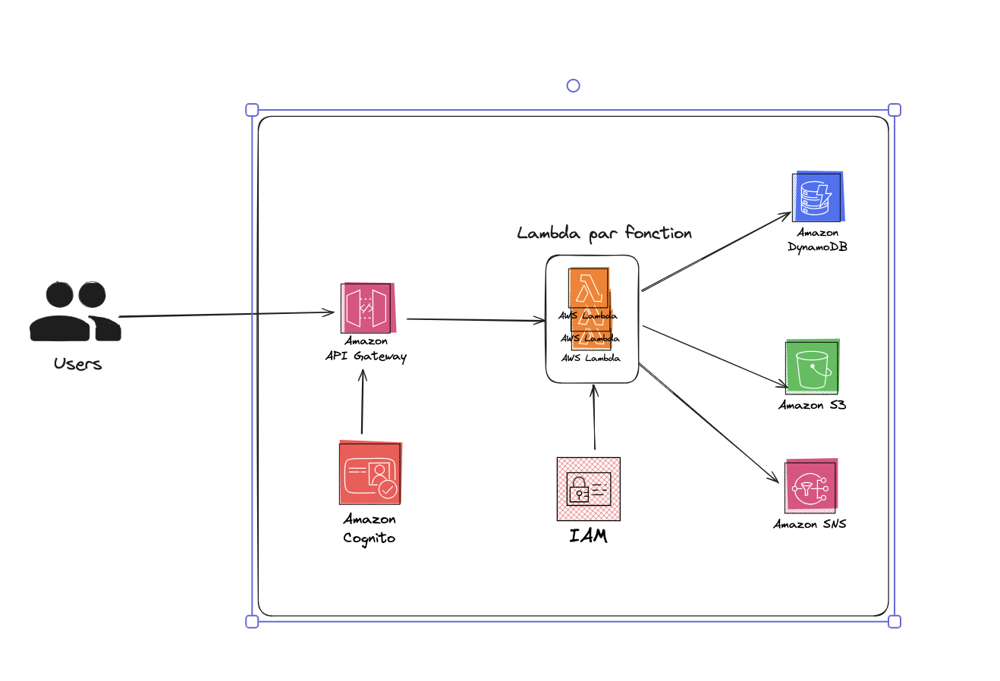

# 5LAMB

Projet serverless pour SUPINFO réalisé par GANGNEUX Alexis et BOISGARD Julien

# Documentation

## Presentation

Blogify est une plateforme de blogging développée en utilisant AWS Lambda. Elle permet la gestion de contenu pour les créateurs, les journalistes, et les entreprises, avec des fonctionnalités de création, modification et gestion de posts via des APIs. Le système repose sur une architecture serverless scalable, incluant la gestion des utilisateurs avec Amazon Cognito, le stockage de contenu dans DynamoDB, et la gestion de médias via S3, assurant une intégration fluide avec tout front-end.

## System overview



1. **Amazon API Gateway**
L’API Gateway sert d'interface principale pour les utilisateurs de la plateforme. Elle expose des endpoints RESTful qui permettent de réaliser des opérations comme la création, la mise à jour, et la suppression de contenu de blog. L'API Gateway agit aussi comme un point d'entrée sécurisé, gérant les appels API entrants et les redirigeant vers les fonctions Lambda.

2. **AWS Lambda**
Les fonctions Lambda sont le cœur du backend. Chacune de ces fonctions est déclenchée par des événements spécifiques. Chaque Lambda est responsable d'une tâche particulière :

*   Gestion des articles : Création, lecture, mise à jour et suppression des articles.
*   Gestion des médias : Téléchargement et récupération d’images et de vidéos.
*   Notifications : Envoi de notifications aux abonnés via Amazon SNS (voir ci-dessous).

Le choix d’une architecture Lambda permet de rendre le système scalable, car les fonctions s’exécutent uniquement lorsque nécessaire, réduisant ainsi les coûts et offrant une gestion efficace des ressources.

3. **Amazon DynamoDB**
DynamoDB est la base de données NoSQL utilisée pour stocker les articles de blog et autres métadonnées. Ce service gère automatiquement la scalabilité, s’adaptant ainsi au nombre croissant d’utilisateurs et de contenus. DynamoDB est rapide et offre une grande disponibilité, ce qui en fait un choix idéal pour les opérations de lecture et d’écriture fréquentes.

4. **Amazon S3**
Amazon S3 est utilisé pour stocker les fichiers multimédias (images, vidéos) qui accompagnent les articles de blog. Il fournit un stockage durable, sécurisé et accessible à grande échelle. Les fonctions Lambda interagissent avec S3 pour uploader et récupérer les fichiers multimédias lorsque les utilisateurs en ont besoin.

5. **Amazon SNS**
SNS est intégré dans l'architecture pour gérer les notifications. Il permet d’envoyer des notifications aux abonnés ou aux utilisateurs lorsque de nouveaux contenus sont publiés, ou pour les tenir informés de mises à jour importantes sur le blog.

6. **Amazon Cognito**
Cognito est utilisé pour la gestion de l'authentification et des utilisateurs. Il permet aux utilisateurs de se connecter en toute sécurité à la plateforme, tout en gérant les permissions via un système basé sur les rôles. Il s'intègre parfaitement à l'API Gateway pour protéger les endpoints sensibles et garantir que seules les personnes autorisées accèdent à certaines fonctionnalités.

7. **IAM (Identity and Access Management)**
IAM est utilisé pour définir les rôles et permissions spécifiques des différents services AWS, garantissant que chaque service accède uniquement aux ressources nécessaires. Par exemple, les fonctions Lambda ont des permissions spécifiques pour interagir avec DynamoDB ou S3, garantissant ainsi une sécurité optimale.

**Pourquoi cette architecture ?**
Cette architecture est conçue pour être modulaire, scalable et coûts-optimisés :

* Modularité : Chaque composant (API Gateway, Lambda, DynamoDB, etc.) remplit une fonction spécifique et indépendante, ce qui facilite la maintenance et les évolutions futures.
* Scalabilité : L'usage de services serverless (Lambda, DynamoDB, S3) permet de gérer facilement une augmentation du trafic ou des utilisateurs sans intervention manuelle.
* Optimisation des coûts : AWS Lambda ne facture que lorsque les fonctions sont exécutées, ce qui réduit les coûts pour un service qui n'est pas utilisé en continu.

En résumé, cette architecture repose sur des composants AWS serverless qui travaillent ensemble pour offrir une solution de blogging performante, évolutive et sécurisée.

## API documentation

Pour ce qui concerne la documentation API, vous trouverez toutes les informations nécessaires dans le fichier `API_documentation.md`

## Setup

Avant de déployer l'architecture il vous faut sur votre machine : 

*   Aws, npm et serverless installés sur votre machine.
*   Veuillez modifier les variables d'environnements dans le fichier `serverless.yml` selon vos besoins.
*   Avoir un compte AWS avec du credit dessus. 

## Deployment Guide

Une fois le Setup pret, placé vous dans le dossier racine du projet et nous pouvons déployer l'application en suivant les commandes ci-dessous :

```Bash

npm install 

aws configure

serverless deploy
```


